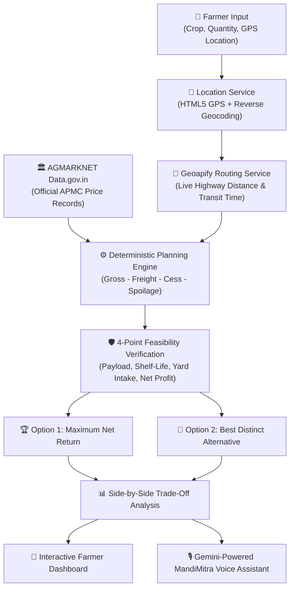

# WayEzee MandiMitra 🌾🚜
### Agricultural Market Mandi Price Arbitrage & Logistics Agent for Farmer Cooperatives
**Hackathon Problem Statement #04 Solution**

[](https://react.dev/)
[](https://vitejs.dev/)
[](https://tailwindcss.com/)
[](https://deepmind.google/technologies/gemini/)
[](https://www.geoapify.com/)
[](https://agmarknet.gov.in/)

---

## 📌 Executive Summary

For millions of farmers and Farmer Producer Organizations (FPOs) across India, **a higher headline mandi price does NOT guarantee higher net profit**. A distant mandi advertising ₹2–₹5/kg higher rates often results in net financial losses once diesel freight, toll charges, APMC cess, unloading charges, and perishable transit weight loss (spoilage) are deducted.

**WayEzee MandiMitra** is an agentic, location-aware decision support system and logistics optimizer that eliminates market speculation. It combines:
1. **Deterministic Financial Planning Engine** (100% mathematically grounded take-home cash calculations).
2. **Dynamic Location Discovery & Geoapify Live Routing** (Exact road distances and driving hours from the farm gate).
3. **Official AGMARKNET Data Feed** (Live APMC prices from Data.gov.in).
4. **Dual Mandi Recommendations** (Option 1: Maximum Net Return & Option 2: Best Distinct Alternative with trade-off analysis).
5. **Google Gemini Conversational AI Assistant** (Bilingual Hindi/English voice assistant explaining verified logistics math).

---

## 📐 The Deterministic Mathematical Formula

The planning engine strictly isolates mathematical computation from generative reasoning, preventing AI hallucinations:

$$\text{Net Return (शुद्ध मुनाफा)} = \text{Gross Produce Value} - \text{Haulage Freight} - \text{Mandi Fees} - \text{Perishable Spoilage Loss}$$

$$\text{Where:}$$
- $\text{Gross Produce Value} = \text{Quantity (kg)} \times \text{APMC Modal Price (₹/kg)}$
- $\text{Haulage Freight} = \text{Actual Road Distance (km)} \times \text{Vehicle Operating Rate (₹/km)}$
- $\text{Mandi Fees} = \text{Fixed Yard Entry} + \text{APMC Cess (1--2\%)} + \text{Handling per Quintal}$
- $\text{Perishable Spoilage Loss} = \text{Quantity} \times (\text{Decay Rate/Hour} \times [\text{Transit Hours} + \text{Queue Wait Hours}]) \times \text{Price}$

---

## 🚀 Key Features

### 1. 📍 Live Location Detection & Dynamic Market Discovery
- Detects the farmer's real-time device location via HTML5 GPS Geolocation and reverse geocodes village/district/state.
- Supports custom farm origin selection across Rajasthan (Kota, Baran, Bundi, Jaipur, Chomu, Ajmer, Jhalawar, etc.).
- Dynamically recalculates highway distances to reachable APMC terminal markets.

### 2. 🎯 Dual Mandi Recommendations (No Hardcoding)
- **Option 1 — Highest Estimated Net Return (अधिकतम शुद्ध मुनाफा)**: The feasible APMC market yielding the maximum take-home cash after all deductions.
- **Option 2 — Best Distinct Alternative (सर्वोत्तम वैकल्पिक मंडी)**: A distinct, viable alternative selected based on proximity, lower transit risk, or freight savings.
- **Side-by-Side Trade-Off Analysis**: Highlights net cash difference (₹), transit time saved (hours), haulage savings (₹), and spoilage risk.

### 3. 🚗 Real Geoapify Live Road Routing
- Integrated with Geoapify Driving Routing API to query real highway travel distances and drive times.
- Accounts for commercial truck routes and toll corridors.
- Fallback matrix for OpenStreetMap / OSRM and Rajasthan highway networks.

### 4. 📊 Verified AGMARKNET Data Integration
- Direct integration with Government of India's Open Data Portal (`Data.gov.in` AGMARKNET API).
- Fetches real-time commodity records: Commodity, Variety, State, District, Market Name, Min Price, Max Price, and Modal Price.

### 5. 🤖 Gemini-Powered MandiMitra Conversational Assistant
- Grounded conversational assistant powered by Google Gemini.
- Communicates in natural, farmer-friendly Hindi and English (`Kisan Bhai` persona).
- Native bilingual Text-to-Speech (TTS) voice playback.
- Strictly adheres to deterministic math: explains the engine's numbers without inventing or guessing figures.

### 6. 🛡️ 4-Point Operational Feasibility Engine
Before recommending any market, the engine validates:
1. **Vehicle Payload Capacity**: Ensures batch weight does not overload the vehicle.
2. **Transit Freshness & Shelf-Life**: Ensures road transit + yard queue fits within the crop's perishable window.
3. **Mandi Intake Capacity**: Verifies APMC terminal intake volume.
4. **Economic Viability**: Guarantees positive net profit.

### 7. 🎛️ What-If Sensitivity Simulator
- Interactive sliders to test market resilience against diesel price fluctuations (₹/km) or sudden mandi rate shifts (₹/kg).

---

## 🏛️ System Architecture



---

## 🛠️ Technology Stack

| Layer | Technologies |
| :--- | :--- |
| **Frontend Framework** | React 18, Vite 5 |
| **Styling & Design** | Tailwind CSS 3.4, Lucide React Icons |
| **Typography & Theme** | Forest Green (`#173B2B`), Harvest Gold (`#B59658`), Warm Cream (`#F7F5EF`) |
| **Conversational AI** | Google Gemini API (`@google/genai` / REST API) |
| **Highway Routing** | Geoapify Driving Routing API v1 |
| **Market Data** | Government of India AGMARKNET API (Data.gov.in) |
| **Location & Geocoding** | HTML5 Geolocation API, BigDataCloud, OpenStreetMap Nominatim |
| **Voice & Speech** | Web Speech API (Native Hindi & English TTS) |

---

## 📦 Getting Started & Local Setup

### Prerequisites
- Node.js (v18.0.0 or higher)
- npm (v9.0.0 or higher)

### Installation Steps

1. **Clone the repository:**
   ```bash
   git clone https://github.com/your-username/wayezee-mandimitra.git
   cd wayezee-mandimitra
   ```

2. **Install dependencies:**
   ```bash
   npm install
   ```

3. **Configure Environment Variables:**
   Copy `.env.example` to `.env`:
   ```bash
   cp .env.example .env
   ```

   Open `.env` and configure your API keys:
   ```env
   # Google Gemini AI Key
   VITE_GEMINI_API_KEY=your_gemini_api_key

   # Government of India AGMARKNET API Key
   VITE_DATAGOV_API_KEY=your_datagov_api_key

   # Geoapify Driving Routing API Key
   VITE_GEOAPIFY_API_KEY=your_geoapify_api_key
   VITE_ROUTING_API_KEY=your_geoapify_api_key
   ```

4. **Run the Development Server:**
   ```bash
   npm run dev
   ```
   Open [http://localhost:5173/](http://localhost:5173/) in your browser.

5. **Production Build & Preview:**
   ```bash
   npm run build
   npm run preview
   ```

---

## 📋 Evaluation Checklist for Hackathon Problem Statement #04

- [x] **Zero Hardcoded Recommendations**: Discovers actual mandis dynamically across Rajasthan based on origin and commodity.
- [x] **Location-Aware Arbitrage**: Incorporates GPS origin into road routing and freight calculation.
- [x] **Dual Mandi Recommendations**: Generates Option 1 (Max Return) and Option 2 (Best Alternative) with multi-factor trade-offs.
- [x] **Real Geoapify Routing**: Evaluates live highway distances and transit hours.
- [x] **Verified AGMARKNET Feed**: Live commodity prices sourced from Data.gov.in.
- [x] **Gemini Conversational Layer**: Explains planning engine results with voice in Hindi and English.
- [x] **Deterministic Math Isolation**: Gemini strictly uses computed metrics; zero hallucination of financial figures.
- [x] **Logistics Feasibility**: Enforces vehicle payload limits, transit freshness windows, and positive net cash constraints.

---

## 📄 License
This project is developed for hackathon demonstration purposes. All rights reserved.
